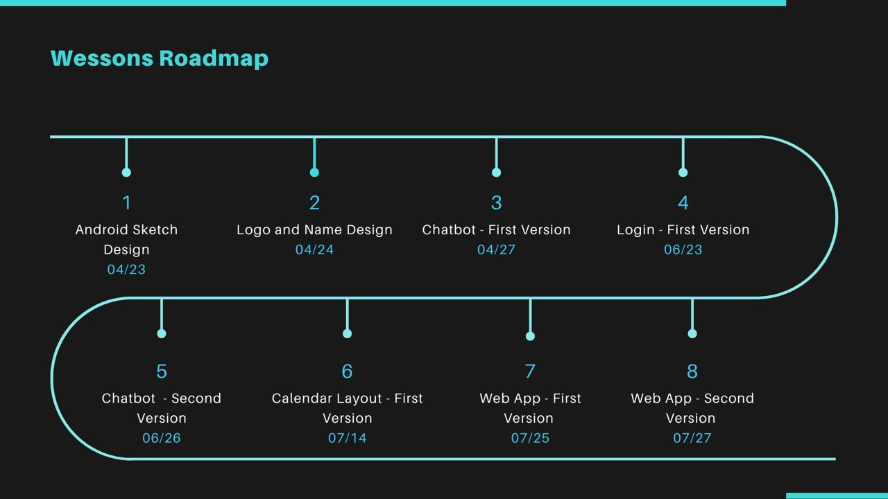
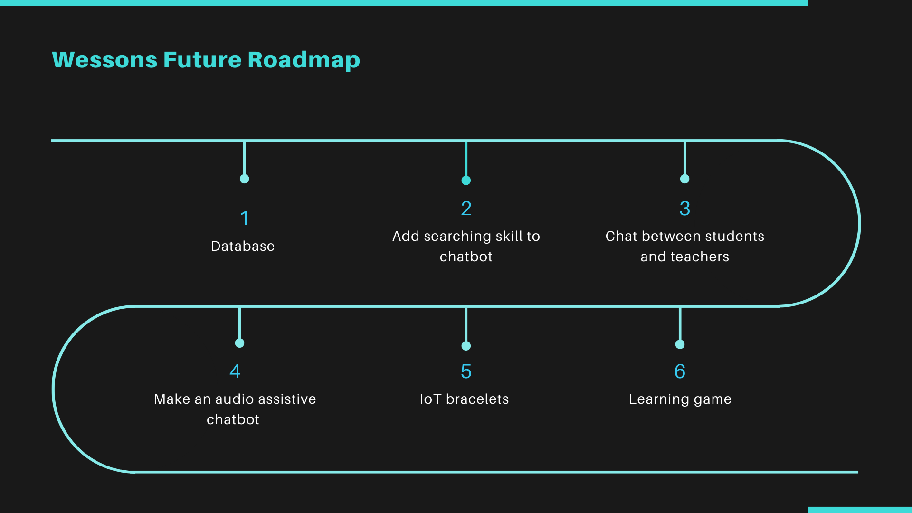

# Wessons

## Short description
Wessons, an intelligent and friendly virtual classroom that makes it easier!

## Long description
[More detail is available here](DESCRIPTION.md)

## Project roadmap

## Demo video
[Watch the video](https://www.youtube.com/watch?v=CrS6cskfkus)

## Built with
* [IBM Cloudant](https://cloud.ibm.com/catalog/services/cloudant) - Used for image storage for the design and for the chatbot
* [IBM Watson Assistant](https://cloud.ibm.com/catalog/services/watson-assistant) - Used to build a chatbot

## Authors
* **Battilana, Mateo**
* **Flores, Gonzalo**
* **Labarque, Aylen**
* **López, Priscila**
* **Pais, Juan**

